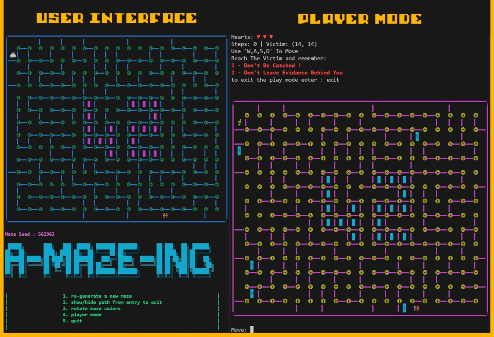

- <b>This project has been created as part of the 42 curriculum by Oussama Amkhou And Oussama Taoussi</b>
<h1>Description</h1>
<ul>
  <strong>A-Maze-ing</strong> is a python project that generates and displays mazes using maze generation algorithms <br>
  The goal of the project is to explore algorithmic maze construction while respecting structural constraints <br>
  The project implements different maze generation strategies such as Depth-First Search and Breadth-First Search to solve the maze and provide the shorteast path.<br>
  In addition we add different bounuses part like Play Mode with more options.<br>
  <strong>Project Goals</strong>
  <ul>
  <li>Understand and implement graph traversal algorithms</li>
  <li>Compare different procedural generation techniques</li>
  <li>Write clean, typed Python code (mypy compliant)</li>
  <li>Provide a fully automated Makefile workflow</li>
  <li>Package implement</li>
  </ul>
</ul>


# Player Mode:
*The Player Mode allows you to navigate the generated maze manually using the keyboard. Your goal is to reach the exit while managing your resources and navigating through dynamic visual effects.*

- 🕹️ **Controls & Navigation**
  - Movement: Use ```W, A, S, D``` keys to move the player through the maze paths.
  - Bonuses: Scattered throughout the maze are **Bonus Boxes**. Collecting these provides a heart for the player
- 💊 **Special Modes**
  - Hallucination Mode: A dynamic visual experience where the maze colors shift and change with every single move you make, creating a trippy and challenging navigation environment.

- 🛠️ **Developer Cheat Codes**
  - For testing and debugging purposes, you can input specific commands to bypass maze difficulty:
  - hplus: Instantly adds a heart to the player's life count.

  - tp [X, Y]: Teleports the player directly to the specified coordinates.

**Note: The destination must be a valid path within the maze boundaries.**
<h1>Instructions</h1>
<ul>
  <strong>Installation</strong> <br>
  <small>Clone the repository and install dependencies:</small> <br>
  <code>make install</code>
  <br>
  <small>This installs required packages using <code>pip</code> and the <code>requirements.txt</code> file.</small> <br>
  <br>
  <strong>Run the Project</strong> <br>
  <code>make run</code> <br>
  <small>This executes the main script using Python.</small> <br>
  <br>
  <strong>Debug Mode</strong> <br>
  <code>make debug</code> <br>
  <small>Runs the program using Python’s built-in debugger (<code>pdb</code>).</small>
  <br><br>
  <strong>Linting</strong> <br>
  <small>Check code quality and static typing:</small> <br>
  <code>make lint</code> <br>
  <small>
    This runs:
    <ul>
    <li><code>flake8</code></li>
    <li><code>mypy</code> with strict typing flags</li>
    </ul>
  </small>
  <br>
  <strong>Clean Temporary Files</strong> <br>
  <code>make clean</code> <br>
  <small>
  Removes:
  <ul>
    <li><code>__pycache__</code></li>
    <li><code>.mypy_cache</code></li>
  </ul>
  </small>
</ul>


<h1>Resources</h1>
<ul>
  <strong>Maze Generation References</strong>
  <ul>
      <li>Youtube</li>
    <ul>
    <a href= "https://youtu.be/ioUl1M77hww?si=rY_LKxkN0dleR-Tm">
      Maze Generation Algorithms</a>
      <br>
      <a href="https://youtu.be/umszOeerdsU?si=58vsdBDCsxa7yX4E">
        Theseus and the Minotaur | Exploring State Space
      </a>
    </ul>
    <li>Wikipidia</li>
    <ul>
      <a href="https://en.wikipedia.org/wiki/Maze_generation_algorithm">
        Maze generation algorithm
      </a>
    </ul>
    <li>Ascii rendering</li>
    <ul>
      <a href="https://www.compart.com/en/unicode/block">
      compart
      </a>
    </ul>
  </ul>
  <sgrong>AI Usage</strong>
  AI tools (ChatGPT) were used during development for:
  <ul>
    <li>Clarification of algorithmic concepts (DFS, Hunt-and-Kill, Prim)</li>
    <li>Understanding Python typing and mypy errors</li>
    <li>Debugging circular import issues</li>
    <li>Improving Makefile configuration</li>
  </ul>
  AI assistance was used strictly for explanation, debugging guidance, and documentation support — not for direct copy-paste of complete solutions.
  <strong>Technologies Used</strong>
  <ul>
    <li>Python 3</li>
    <li>ANSI terminal rendering</li>
    <li>flake8</li>
    <li>mypy</li>
    <li>Makefile automation</li>
  </ul>
</ul>
<h1>Config file structure and format</h1>
<ul>
    <small>
      <b>the config file providing as a key=value format<b> <br>
      <ul>
        <code>
          # reqire entires <br>
          WIDTH=width size  <br>
          HEIGHT=height size <br>
          ENTRY=x, y <br>
          EXIT=x, y <br>
          OUTPUT_FILE=output_file <br>
          PERFECT= boolean is activated, the maze must contain exactly one path between the entry and the exit <br>
          # optional entries <br>
          ANIMATE= boolean <br>
          SEED= integer to get a maze seed <br>
          HALLUCINATION=boolean themes effect when play mode is actived <br>
        </code>
      </ul>
    </small>
  </ul>


<h1>chosen maze generation algorithm</h1>
<ul>
  <h3>Depth-First Search (DFS) – Recursive Backtracker</h3>
  <strong>Description</strong>
  <ul>
    The first algorithm implemented is the Depth-First Search (DFS) maze generator, also known as the Recursive Backtracker.
    <br>
    it works by:
    <ul>
      <li>Starting from an initial cell.</li>
      <li>Randomly selecting an unvisited neighbor.</li>
      <li>Carving a passage and moving forward.</li>
      <li>Backtracking when no unvisited neighbors remain.</li>
    </ul>
    This process continues until all cells have been visited.
  </ul>

  <strong>Why We Chose DFS</strong>
  <ul>
    DFS was chosen because:
    <ul>
      <li>It is simple to implement and understand.</li>
      <li>It produces clean, long corridors.</li>
      <li>It guarantees a perfect maze (only one path between any two cells).</li>
      <li>It is widely documented and academically recognized.</li>
    </ul>
    <br>
    <h3>Breadth-First Search (BFS)</h3>
  <strong>Description</strong>
  <ul>
    The second approach is inspired by Breadth-First Search (BFS) principles. <br>
    Instead of exploring deeply along one path, BFS-based generation expands outward layer by layer, using a frontier structure (queue or frontier list).
    <br>
    This produces mazes that:
    <ul>
      <li>Have more branching</li>
      <li>Contain shorter corridors</li>
      <li>Look more “balanced” and less linear</li>
    </ul>
  </ul>

  <strong>Why We Chose BFS</strong>
  <ul>
    BFS was selected because:
    <ul>
      <li>BFS is primarily used to find the shortest path in an unweighted graph.</li>
      <li>Find shortest path</li>
    </ul>
  </ul>
</ul>


<h1>Team and Project Management</h1>
<h3>Roles</h3>
<ul>
  The project was developed collaboratively with a clear division of responsibilities.
  <br>
  <strong>Amkhou</strong>
  <ul>
    Responsible for the core logic and infrastructure:
    <li>Cell class</li>
    <ul>
      <li>Cell structure</li>
      <li>Wall representation</li>
      <li>Visited/blocked state</li>
      <li>Coordinates and direction handling</li>
      <li>Implementation of the special “42” blocked cells area</li>
    </ul>
    <li>Parser</li>
    <ul>
      <li>Configuration file parsing</li>
      <li>Input validation</li>
    </ul>
    <li>Solver</li>
    <ul>
      <li>BFS-based shortest path algorithm</li>
    </ul>
    <li>Main Program (<code>a_maze_ing.py</code>)</li>
    <ul>
      <li>User input</li>
      <li>Entry point</li>
      <li>Algorithm selection</li>
      <li>Program orchestration</li>
    </ul>
    <li>Makefile</li>
    <ul>
      <li>Automation rules (install, run, debug, lint, clean)</li>
    </ul>
  </ul>
  <br>
  <strong>Taoussi</strong>
  <ul>
    Responsible for generation and user interaction:
    <li>Maze Generator (DFS)</li>
    <ul>
      <li>Recursive Backtracking implementation</li>
    </ul>
    <li>ASCII Renderer</li>
    <ul>
      <li>Terminal visualization</li>
      <li>Color themes and animations</li>
    </ul>
    <li>Encoder</li>
    <ul>
      <li>Exporting maze to output file</li>
    </ul>
    <li>Play Mode</li>
    <ul>
      <li>Interactive maze navigation</li>
      <li>User options handling</li>
    </ul>
    <li>Packaging</li>
    <ul>
      <li><code>pyproject.toml</code></li>
      <li>Reusability build (<code>.whl</code>, <code>.tar.gz</code>)</li>
    </ul>
  </ul>
</ul>
<h3>Project Planning and Evolution</h3>
<ul>
  <strong>Initial Plan</strong> <br>
  <br>
  The initial objective was to:
  <ul>
    <li>Implement a functional maze generator (DFS).</li>
    <li>Add a BFS solver for shortest path computation.</li>
    <li>Provide ASCII rendering.</li>
    <li>Respect maze structural constraints (no 3×3 open areas).</li>
    <li>Automate workflow using a Makefile.</li>
    <li>Reusablility and package build</li>
  </ul>
  <br>
  <strong>How It Evolved</strong> <br>
  <br>
  During development:
  <ul>
    <li>The architecture became more modular.</li>
    <li>AThe project was structured as a proper Python package (<code>mazegen</code>).</li>
    <li>Static typing with <code>mypy</code> was added.</li>
    <li>Packaging and distribution files were implemented.</li>
    <li>Multiple gameplay and rendering improvements were introduced.</li>
  </ul>
  The scope gradually expanded from a simple generator to a complete modular maze framework.
</ul>
<h3>What Worked Well</h3>
<ul>
  <li>Clear division of responsibilities.</li>
  <li>Modular architecture (generator, solver, renderer separated).</li>
  <li>Use of GitHub branches for feature isolation.</li>
  <li>Early integration of linting and type checking.</li>
  <li>Successful packaging into distributable formats.</li>
</ul>
<h3>What Could Be Improved</h3>
<ul>
  <li>Maze visualization is currently limited to ASCII terminal rendering.</li>
  <li>A graphical interface (e.g., Tkinter, Pygame, or web visualization) would improve clarity.</li>
</ul>
<h3>Tools Used</h3>
<ul>
  <li>Python3</li>
  <li>Github</li>
  <ul>
    <li>Branch-based collaboration</li>
    <li>Code merging and review</li>
  </ul>
  <li>Makefile</li>
  <ul><li>Automated workflow</li></ul>
  <li>mypy</li>
  <ul><li>Static type checking</li></ul>
  <li>flake8</li>
  <ul><li>Code style enforcement</li></ul>
  <li>pip / build</li>
  <ul><li>Packaging and distribution</li></ul>
</ul>